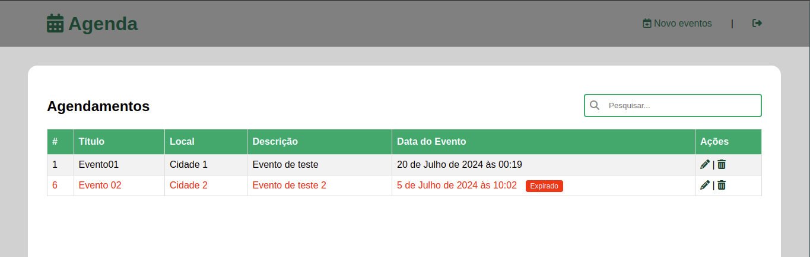

# Agenda de Evendos


<p align="center">Uma estrutura <a href="https://www.djangoproject.com/" target="_blank">Django</a> criado para realização de agendamento de eventos, contendo um CRUD básico e usando autenticação de usuário.</p>
<p align="center">
   
</p>
<p align="center">
  
</p>
# Índice

1. [Tecnologias](#tecnologias)
2. [Instalação](#instalação)
3. [Acesso ao Sistema](#acesso-ao-sistema)
4. [Estrutura do Projeto](#estrutura-do-Projeto)


## Tecnologias:

- Django

# Instalação

1. **Criar um Ambiente Virtual**:

   ```sh
   python -m venv myenv
   ```

2. **Ativar o Ambiente Virtual**:

   - No Windows:
     ```sh
     myenv\Scripts\activate
     ```
   - No Unix ou MacOS:
     ```sh
     source myenv/bin/activate
     ```

3. **Instalar Dependências**:
   ```sh
   pip install -r requirements.txt
   ```
4. **Executar projeto**

```sh
python3 manage.py runserver
```

# Acesso ao Sistema

Já existe um usuário administrativo `admin` criado no bando de dados do sqlite.
Sua credências são:

## Usuário administrador
- **E-mail:** admin@agenda.com
- **Usuário:** admin
- **Senha:** 123456

## Usuário de testes
- **E-mail:** teste@agenda.com
- **Usuário:** guest
- **Senha:** 123@mudar

## Criar um novo usuário adminitrativo
```sh
python3 manage.py createsuperuser
```
Também pode estar acessando o painel administrativo do django, logar com o admin, acessar os **Usuários** e clicar em **ADICIONAR USUÁRIO**.
# Estrutura do Projeto
## Apps
   - Core

## Rotas
   - `admin/`: Painel administrativo do próprio Django
   - `agenda/`: Listagem de eventos